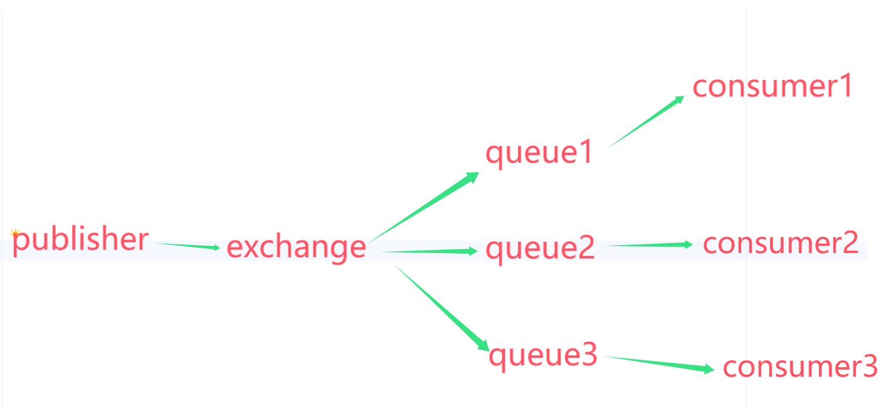

# PHP_Kafka_ES_Rabbitmq
php消息中间件Kafka/ES/RabbitMQ


**常用的 Docker 操作命令：**
```shell
# 启动并进入项目中的服务容器，--rm 表示退出容器后自动删除容器
docker-compose run --rm php-cli bash

#创建Laravel项目
composer create-project --prefer-dist laravel/laravel PHP_Kafka_ES_RabbitMQ

# kafka PHP客户端安装
composer require nmred/kafka-php

# rabbitmq PHP客户端安装
composer require php-amqplib/php-amqplib
```


```txt
RabbitMQ常见重点问题

1. 消息的可靠性问题,如何确保发送的消息至少被消费一次 ? 
    * 生产者消息确认 
        > publisher-confirm 发送者确认消息是否投递到交换机 成功返回ack,失败返回nack; 
        > publisher-return  发送者回执,消息投递到交换机了,但是没有路由到队列,返回ack及路由失败原因;
    !! 确认消息发送机制时,需要给每一个消息设置一个全局唯一id,以区分不同消息,避免ack冲突
    
    * 消息持久化
    
    * 消费者消息确认
    
    * 消费者失败重试机制
    
2. 延迟消息问题,如何实现消息的延迟投递 ? -> 死信交换机
     
3. 消息堆积问题,如何解决百万消息积压,无法及时消费的问题 ?
    惰性队列
4. 高可用问题,如何解决单点MQ故障而导致的不可以问题 ? 
    MQ集群
 

```


